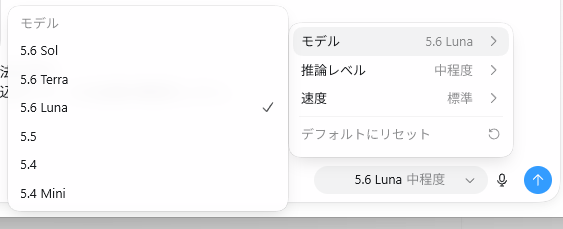
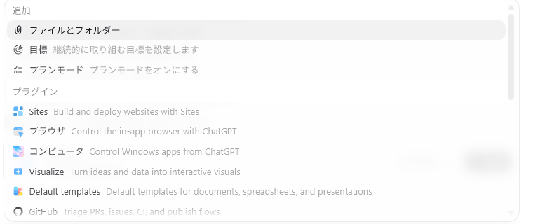

# 本編 第1部：ChatGPTアプリから資料作成まで

## 位置づけ

ChatGPTアプリの基本操作から、プロジェクトを使った継続作業、指示の出し方、Markdown・HTMLでの資料作成までを扱います。

### 目安時間

約2〜3時間。受講者の理解度に応じて調整します。

## 1. ChatGPTアプリを入れて基本操作

### ねらい

ChatGPTを「質問に答える画面」ではなく、作業を始める入口として理解します。

### ダウンロード

[ChatGPT公式ダウンロードページ](https://chatgpt.com/ja-JP/download/)

### 操作すること

1. ChatGPTアプリを起動する
2. アカウントにログインする
3. 左メニューを確認する
4. 新しいチャットまたは新しいタスクを始める
5. モデルやツールの入口を確認する
6. 回答をコピー・共有・保存する
7. 必要に応じてファイルや画像を添付する

### 最初の練習

```text
あなたは初心者向けのアシスタントです。
「ChatGPTを使ってできること」を、仕事・学習・趣味の3分野に分けて、各3個ずつ表にしてください。
専門用語はできるだけ使わないでください。
```

### ここで伝えること

- 1回の質問で完成させようとしなくてよい
- 回答に対して「もっと短く」「表にして」など追加指示できる
- 分からない回答が出たら、そのまま貼って原因を聞ける
- 最新情報を調べる場合はWeb検索を使う
- 重要な内容は、回答を鵜呑みにせず確認する

## 2. プロジェクトを作って会話を始める

### ねらい

長く続く作業を、毎回ゼロから説明しない方法を体験します。

### プロジェクトの考え方

プロジェクトは、ChatGPT内で会話・ファイル・専用指示をまとめる作業スペースです。

```text
プロジェクト
├── 専用の指示
├── 参考ファイル
├── 過去の会話
└── 今回の作業
```

### 実習例：自分用の学習プロジェクト

プロジェクト名の例：

- Python学習
- ChatGPT活用講座
- 自分のWebサイト制作
- 毎月のレポート作成
- 趣味の調査ノート

プロジェクト指示の例：

```text
あなたは私の学習サポーターです。
私は初心者なので、専門用語を使うときは簡単な説明を添えてください。
回答は、結論、理由、次にやることの順にしてください。
私が理解できていないように見える場合は、先に確認質問をしてください。
```

### 注意

ブラウザ版のChatGPTでは、プロジェクトは主に会話・ファイル・専用指示をまとめる場所として使われます。

一方、Work（Codex）でプロジェクトを作成する場合は、成果物やコードなどを扱うローカルの作業領域として利用できます。Windowsでは、新規プロジェクトを作成すると、通常は次のような場所にフォルダーが作成されます。

```text
C:\Users\＜ユーザー名＞\Documents\＜プロジェクト名＞\
```

そのため、Workで使う場合は、プロジェクトを「会話を整理する場所」と考えるだけでなく、「AIと一緒に成果物を作る作業フォルダー」と考えると分かりやすくなります。

## 3. モデル・推論・承認方法を試す

ここでは、入力欄の周辺にある設定を一通り試します。モデルを選ぶだけでなく、入力方法、音声、ファイル添付、目標、プランモード、承認の考え方まで確認しておくと、ChatGPTを「質問に答えるだけの画面」から、作業を進めるための道具として使えるようになります。

### 入力欄の全体像


入力欄では、次の操作を使い分けます。

| 場所・機能 | できること | 使いどころ |
|---|---|---|
| メッセージ欄 | 依頼、質問、条件、文章の貼り付け | すべての作業の入口 |
| ＋ | ファイル、画像、目標、プランモードなどを追加 | 入力を拡張したいとき |
| モデル名 | 使用するモデルを変更 | 精度・速度・コストを調整 |
| マイク | 音声入力・音声会話 | 長文を話して入力したいとき |
| 送信ボタン | 入力した内容を実行 | 送信前に個人情報や条件を確認 |

#### 入力は「目的・材料・条件・出力形式」で組み立てる

たとえば、次のように書くと、回答が安定します。

```text
目的：この資料を初心者向けに説明したい
材料：以下の文章と添付画像
条件：専門用語はかみくだく。不明な点は推測しない
出力：見出し、要点、具体例、注意点の順にする
```

短い質問でも使えますが、仕事で再利用する場合は「誰向けか」「何に使うか」「どの形式でほしいか」を加えるのがコツです。画像やファイルを添付するときは、ファイルを読んで何をしてほしいのかも一緒に書きます。

### モデルを選ぶ



モデルは、同じChatGPTでも得意分野、回答の精度、速さ、利用コストのバランスが異なります。画面に表示されるモデル名や利用上限は、プラン・時期・アカウントによって変わるため、次の表は教材用の「相対的な選び方」です。

| モデル | 得意な使い方 | 精度 | 速度 | コスト目安 |
|---|---|---:|---:|---:|
| **5.6 Sol** | 複雑な設計、重要な判断、難しい分析 | ★★★★★ | △ | 1.00（基準） |
| **5.6 Tera** | 日常業務、文章整理、資料作成 | ★★★★☆ | ○ | 約0.60 |
| **5.6 Luna** | 下書き、要約、アイデア出し、軽い作業 | ★★★★ | ◎ | 約0.35 |

このコスト比は公式の固定料金ではなく、同じ作業を比べるための教材用の相対目安です。実際の料金、回数制限、利用可能なモデルはアプリ内の表示や公式の料金・プラン案内を確認してください。

迷ったら、次の選び方が無難です。

- **精度重視：5.6 Sol** — 複雑な推論、コード、重要な資料、間違いを減らしたい作業
- **コスパ重視：5.6 Luna** — 下書き、要約、短い文章、アイデアのたたき台
- **中間：5.6 Tera** — 日常的な資料作成や整理。まず試す標準的な選択

つまり、基本は5.6系を使い、精度が必要ならSol、コストを抑えるならLuna、その中間ならTeraという考え方です。最初から一番高いモデルに固定するのではなく、軽い下書きをLunaで作り、最終確認だけSolに任せる使い分けもできます。

### 推論レベルと速度

モデル選択の中に「推論レベル」や「速度」の設定がある場合は、考える深さと待ち時間のバランスを調整します。

- 低め・速め：短い要約、言い換え、簡単な質問
- 中程度：一般的な資料作成、比較、整理。迷ったときの標準設定
- 高め・深め：複数条件の整理、設計、コード調査、反論を含む検討

推論を深くすると、必ず正解になるわけではありません。材料が不足している場合は、推論を深くするより、必要な資料や条件を追加するほうが効果的です。

### 音声入力

入力欄のマイクを押すと、キーボードで入力せずに話しかけられます。長い説明、思いついたアイデア、移動中のメモに便利です。

1. マイクを押す
2. 普通の声量で、目的と条件を話す
3. 文字起こしされた内容を確認する
4. 固有名詞、数字、日付、金額を修正して送信する

音声認識は、会社名、人名、専門用語、数字を誤ることがあります。「1,000円」「2026年7月13日」など重要な情報は、送信前に画面で確認してください。音声会話が使える場合でも、最終的な依頼内容や数値はテキストで残すと再確認しやすくなります。

### ＋を押したあとの機能



＋を押すと、入力欄に追加できる機能が表示されます。表示項目はプラン、端末、ワークスペース設定、段階的な提供状況によって変わります。

| メニュー | 概要 | 例 |
|---|---|---|
| ファイルとフォルダー | 文書、表計算、画像などを読み込む | PDFを要約、表を整理、画像を説明 |
| 目標 | 継続して取り組む目標を設定する | 毎週の学習、長期の資料作成、習慣化 |
| プランモード | いきなり実行せず、先に手順を考える | 大きな作業、複数ステップの企画 |
| Sites | WebサイトやWebアプリを作る | カレンダー、フォーム、公開ページ |
| ブラウザ | Webページを操作・確認する | サイトの表示確認、Web上の情報確認 |
| コンピュータ | Windowsなどの画面操作を依頼する | アプリを開く、画面上の定型操作 |
| Visualize | データや仕組みを図・グラフにする | 比較表、シミュレーター、可視化 |
| Default templates | 文書・表計算・プレゼンの雛形を使う | 報告書、一覧表、スライド |
| GitHub | リポジトリや開発作業と連携する | Issue、PR、CIの確認 |

#### 目標

目標は、短い一問一答ではなく、一定期間続くテーマをまとめる機能です。「何をいつまでに達成したいか」「途中で何を確認するか」を設定すると、会話や作業の方向を保ちやすくなります。ただし、目標を設定しただけで自動的にすべてが実行されるわけではありません。必要な作業や確認は、通常の依頼として具体的に指示します。

#### プランモード

プランモードは、いきなりファイルを変更したり作業を実行したりせず、まず計画を出させるための機能です。次のようなときに向いています。

- 何個もの手順がある
- 先に全体像と見積もりを知りたい
- 作業前に方針を確認したい
- 変更してよい範囲を限定したい

プランを確認した後、「この計画で進めて」と明示して実行に移します。小さな質問や単純な文章修正では、通常モードのほうが速く進みます。

### 承認方法と権限

ファイルの変更、外部サービスへの接続、コマンド実行、メッセージ送信などを行う場合、実行前に承認を求められることがあります。承認画面では、次の3点を確認します。

1. 何を実行するのか
2. どのファイル、サイト、アカウントに影響するのか
3. 実行後に元へ戻せるのか

「常に許可」「今回だけ許可」「拒否」などの選択肢がある場合、最初は今回だけ許可が安全です。内容が分からない操作や、削除・公開・送信を伴う操作は、承認せずに質問して確認します。便利さを優先して権限を広げすぎると、意図しない変更や情報送信につながるためです。

### ここで試す練習

1. 5.6 Lunaで、短い文章を3行に要約する
2. 5.6 Teraで、同じ文章を初心者向けに説明する
3. 5.6 Solで、反対意見と注意点を追加する
4. ＋から画像を添付し、「内容を読み取り、重要な数字だけ表にする」と依頼する
5. プランモードで「この資料を報告書にする手順」を作り、内容を確認する
6. 最後に承認画面が出たら、対象と操作内容を読んでから許可する

### ねらい

作業によって、速さ・深さ・利用量を使い分ける感覚を持ちます。

### 比較する課題

```text
次の文章を100文字以内で要約してください。
```

```text
次の文章について、前提、論点、反対意見、実行上の注意点を整理してください。
最後に、内容に誤りがないか確認すべき点を挙げてください。
```

### 使い分けの目安

| 作業 | 向いている設定 |
|---|---|
| 短い要約、言い換え | 速さ重視 |
| アイデア出し | 速さと回数重視 |
| 複雑な整理、設計 | 推論の深さ重視 |
| コードの原因調査 | 推論の深さ重視 |
| 最新情報の確認 | Web検索や調査機能を併用 |

### 承認について

外部アプリ、ローカルファイル、コマンド実行などを扱う場合は、実行前に承認を求められることがあります。

- 何を実行しようとしているか読む
- ファイル変更や外部送信があるか確認する
- 分からない操作は承認せず質問する

## 4. 資料を作る

### ねらい

構成・下書き・修正・出力の順に進め、Notionに貼れる資料を作ります。


### ステップ1：目的を決める

```text
ChatGPT初心者向けの使い方資料を作りたいです。
対象者は、ChatGPTを数回使ったことがある程度の人です。
読んだ人が、今日から自分で質問できるようになる資料にしてください。
```

### ステップ2：構成を作る

```text
まず本文を書かずに、資料の章立てだけを作ってください。
各章について、目的、読者ができるようになること、実習内容を表にしてください。
```

### ステップ3：本文を作る

```text
第1章を書いてください。
初心者向けに、短い説明、操作手順、入力例、注意点、練習問題の順にしてください。
```

### ステップ4：Markdownで出力する

```text
この章をNotionに貼り付けやすいMarkdown形式に整えてください。
見出し、箇条書き、表、コードブロックを適切に使ってください。
```

### ステップ5：HTMLにする

```text
この資料を、ブラウザで読めるHTMLにしてください。
見出し、表、コードブロック、注意書きが見やすいデザインにしてください。
外部ライブラリは使わず、1ファイルで動くようにしてください。
```

### 成果物の確認

- 目的と対象者が一致しているか
- 手順が抜けていないか
- 入力例をそのまま試せるか
- 事実と推測が混ざっていないか
- Notionに貼ったときに読みやすいか
