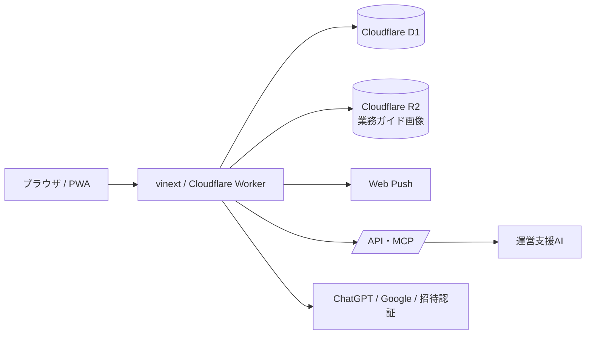

# KINBAN アーキテクチャ

この文書は、コードを読む前に実行時の境界を把握するための概要です。具体的なカラム定義は `db/schema.ts`、変更履歴は `drizzle/`、API の入力と出力は各 route と `app/mcp/route.ts` を正本とします。

## 環境境界

| 環境 | 設定の正本 | データ | 用途 |
| --- | --- | --- | --- |
| ローカル | `.env.local`、Wrangler local binding | local D1 | 開発・破壊的な検証 |
| 公開デモ | Sites/Workers の環境変数 | デモ用D1 | 体験・画面確認。リセット可 |
| 本番 | デプロイ先のSecret/環境変数 | 本番D1/R2 | 実運用。リセット禁止 |

環境変数を切り替えるだけでデモと本番を兼用する方針で、グループIDによる環境判定は行いません。`DEMO_MODE` と `NEXT_PUBLIC_DEMO_MODE` がデモ表示・デモ時刻の基準です。

## 主要な実行境界

- ブラウザは表示・入力を担当し、権限判定と重要な再計算はサーバー側で行う。
- D1 は業務記録の正本であり、画面状態やMCPの応答を正本とはしない。
- R2は業務ガイドの添付画像などのバイト列を保存する。参照権限はD1のページ・グループ権限で確認する。
- MCPはAPIの別入口で、トークン種別、グループ、scope、confirm、expectedVersion、claimIdをサーバーで検証する。
- Web Pushは補助通知であり、未読・未処理状態はD1を正とする。

## 更新時の基本順序

1. 正本（schema、migration、route、seed、設定）の変更を先に確認する。
2. 読み取りで対象グループ・期間・状態・versionを確認する。
3. 破壊的操作はローカルで検証し、公開・本番は明示確認を取る。
4. UI・API・MCP・ブラウザの各入口で同じ業務ルールを確認する。

