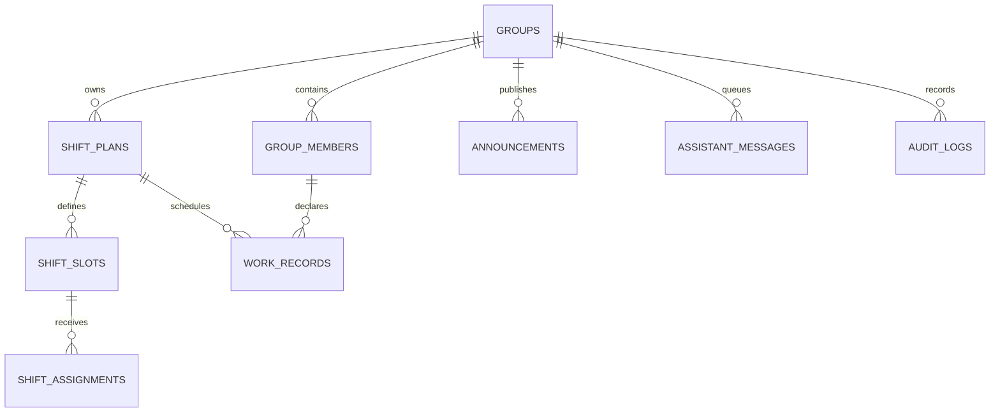

# KINBAN ドメインモデル

全カラムの辞書ではなく、業務上の関係と不変条件を記録します。カラム・型・インデックスは `db/schema.ts`、変更順序は `drizzle/` を参照してください。

## 領域

- **グループ・メンバー**: `groups` と `group_members`。権限はグループ単位で、代表管理者・管理者・メンバーを持つ。停止メンバーは履歴を残すが、通常の母数と新規割当から除外する。
- **シフト**: `shift_plans` が期間・状態、`shift_slots` が日時・担当・必要人数、`shift_assignments` が人員を表す。公開済みシフトは画面/API/MCPで同じ状態を参照する。
- **希望**: 基本希望と期間内の上書きを分ける。保存時刻を記録し、管理者が未提出を確認できる。
- **勤務**: `work_records` はグループ・本人・対象日単位の集約記録。複数枠の日は枠の合計を予定として扱い、枠間の空白を予定休憩とする。
- **承認**: 日次状態と、人×月の月次状態を分ける。月次承認済みは勤務記録をロックし、解除は管理者操作と監査ログを要求する。
- **連絡・AI**: お知らせ、返信、AIメッセージ、claim、execution leaseを分ける。処理中のメッセージはclaimIdを持つ処理主体だけが更新できる。
- **業務情報**: 業務ガイドはD1の本文と、必要に応じたR2画像を持つ。業務メモは原則本人と管理者が閲覧する。

## 不変条件

1. グループをまたぐ枠・メンバー・トークンを一つの更新に混在させない。
2. 勤務記録の予定時刻・予定休憩は、公開済み割当枠からサーバー側で再計算する。
3. 月次承認済みの勤務記録は、解除されるまで本人から変更できない。
4. 公開・承認・差戻し・通知などの重要操作は権限、confirm、必要なclaimを確認する。
5. 外部公開URL（ICS等）はURL自体を閲覧鍵として扱い、ログへ記録しない。

